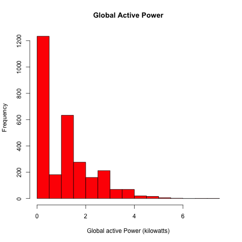
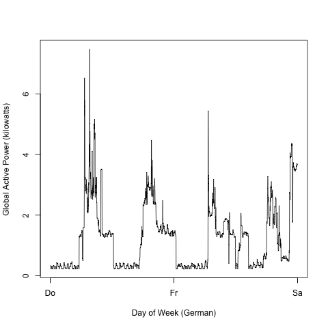
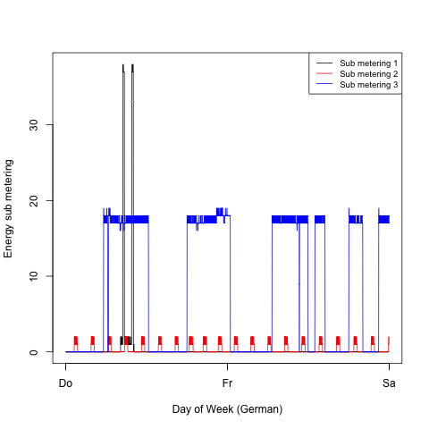
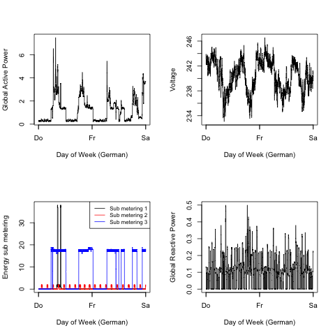

## Note:

This graphics were produced on a LOCALE=DE system, so the Days
of the week are Do, Fr, Sa

Although this could be corrected using xaxis - I didn't do it 
because this would be extra work for non-English students.

## Info:

This assignment uses data from
the <a href="http://archive.ics.uci.edu/ml/">UC Irvine Machine
Learning Repository</a>, a popular repository for machine learning
datasets. In particular, we will be using the "Individual household
electric power consumption Data Set" which I have made available on
the course web site:

* <b>Dataset</b>: <a href="https://d396qusza40orc.cloudfront.net/exdata%2Fdata%2Fhousehold_power_consumption.zip">Electric power consumption</a> [20Mb]

* <b>Description</b>: Measurements of electric power consumption in
one household with a one-minute sampling rate over a period of almost
4 years. Different electrical quantities and some sub-metering values
are available.

# My Results

 

 

 

 
